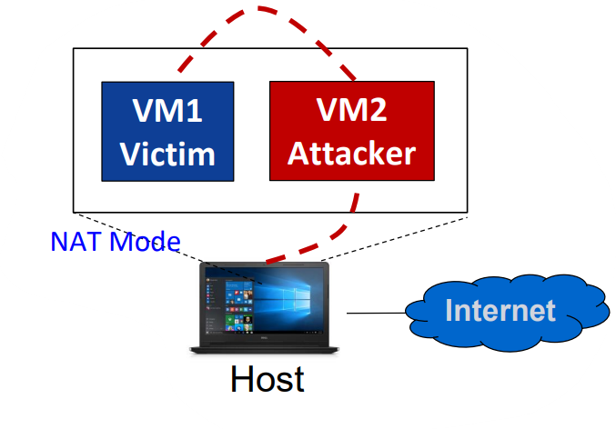
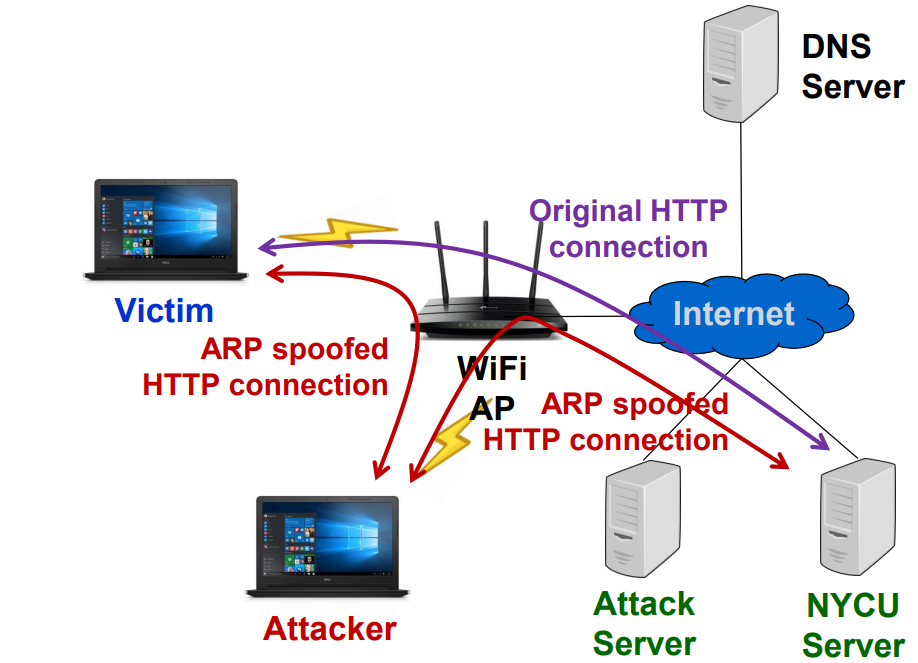
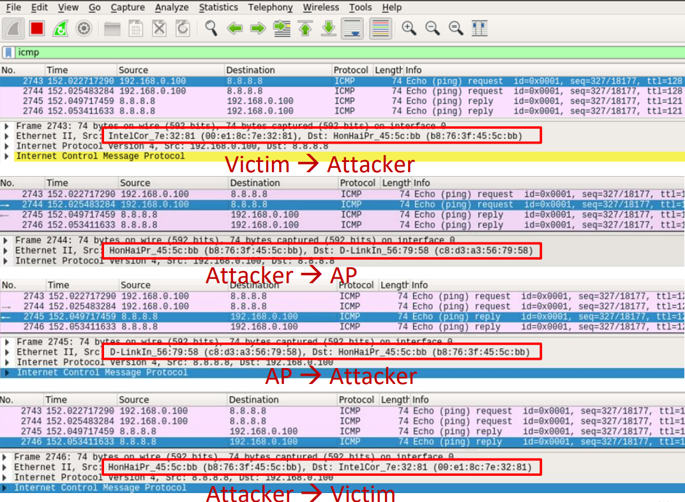
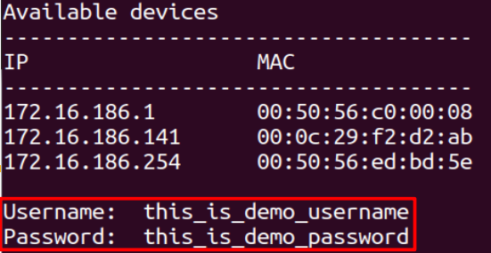
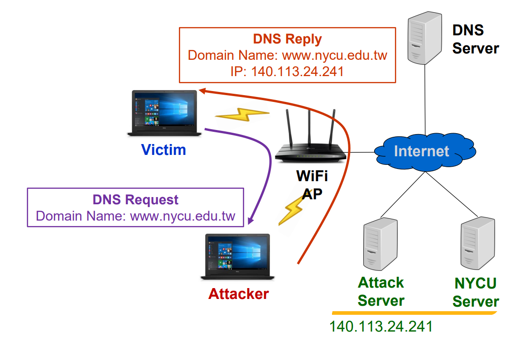
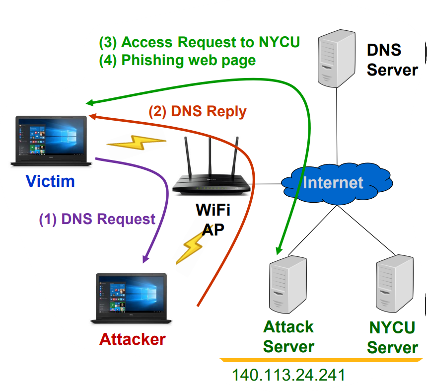

<a name="readme-top"></a>

<!-- PROJECT LOGO -->
<h3 align="center">CSC Project2 - Man in the Middle Attack and Pharming Attack</h3>
<p align="center">
This project delves into network security vulnerabilities, focusing on ARP spoofing, Man-In-The-Middle (MITM), and pharming attacks. Implemented in C++, it demonstrates how to execute these attacks and explores their inner workings and defenses.
</p>

<!-- TABLE OF CONTENTS -->
<details>
  <summary>Table of Contents</summary>
  <ol>
    <li>
      <a href="#about-the-project">About The Project</a>
    </li>
    <li>
      <a href="#getting-started">Getting Started</a>
    </li>
    <li><a href="#usage">Usage</a></li>
    <li><a href="#verification-steps">Verification Steps</a></li>
    <ul>
        <li><a href="#mitm-attack">Man in the Middle Attack</a></li>
        <li><a href="#pharming-attack">Pharming Attack</a></li>
    </ul>
    <li><a href="#disclaimer">Disclaimer</a></li>
  </ol>
</details>

<!-- ABOUT THE PROJECT -->

## About The Project

This project is a comprehensive exploration of network security vulnerabilities and attack vectors, specifically focusing on ARP spoofing, Man-In-The-Middle (MITM), and pharming attacks. Implemented in C++, the project showcases how these attacks can be conducted and provides insights into their mechanisms.

### Key Components

- **ARP Spoofing**: The project starts by implementing ARP spoofing to deceive devices on a local Wi-Fi network. By pretending to be the gateway, the attacker can redirect network traffic through their machine, making it possible to monitor and manipulate the data.

- **Man-In-The-Middle (MITM) Attack**: Using the ARP spoofing setup, the project demonstrates a MITM attack. The attacker intercepts HTTP traffic and extracts sensitive information, such as usernames and passwords, from HTTP POST requests. This illustrates the risks associated with unsecured network communication.

- **Pharming Attack**: The project also explores pharming attacks, where DNS responses are manipulated to redirect users from legitimate websites to malicious ones. This is done by altering DNS resolution responses on the network, effectively hijacking attempts to visit specific websites and directing them to different, often malicious, destinations.

### Implementation Overview

1. **ARP Spoofing Setup**: 
   - The attacker tool performs ARP spoofing to position itself between the target devices and the network gateway.
   - This enables the attacker to intercept all network traffic flowing through the gateway.

2. **MITM Attack Execution**:
   - Once ARP spoofing is in place, the attacker captures and analyzes HTTP traffic.
   - The focus is on extracting sensitive data from HTTP POST requests, such as login credentials.

3. **Pharming Attack Execution**:
   - Instead of merely intercepting data, the attacker manipulates DNS responses to redirect traffic.
   - For example, requests to visit a trusted website can be rerouted to a fake or malicious site under the attacker's control.

### Project Goals

- **Demonstrate Network Vulnerabilities**: Show how ARP spoofing can be exploited to execute more complex attacks like MITM and pharming.
- **Highlight the Importance of Network Security**: Educate on the potential dangers of unsecured networks and the need for robust security measures.
- **Provide a Learning Tool**: Serve as a practical example for students and professionals to understand and analyze the mechanics of these attacks.


<p align="right">(<a href="#readme-top">back to top</a>)</p>

<!-- GETTING STARTED -->
## Getting Started

To set up the project locally and observe the attacks in action, follow the steps below:

### Prerequisites

Ensure you have the following installed on your system:
- A C++ compiler (e.g., GCC)
- Basic networking tools (e.g., `tcpdump`, `netcat`, `wireshark`)
- Linux Environment: This tool is designed for Linux systems as it relies on raw sockets and Netfilter Queue (NFQUEUE).
- Libnetfilter_queue: The tool requires libnetfilter_queue for handling packets. Install it using:
    ```bash
    sudo apt-get install libnetfilter-queue-dev
    ```
- Root Privileges: Running the tool requires root privileges to send raw packets and manipulate system settings.

### Building the Project

1. Clone the repository to your local machine.
   ```bash
    git clone https://github.com/bee0511/Computer-Security-Capstone.git
   ```
2. Navigate to the project directory.
   ```bash
   cd project2
   ```
3. Compile the project using the provided Makefile.
   ```bash
   make
   ```

<p align="right">(<a href="#readme-top">back to top</a>)</p>

<!-- USAGE EXAMPLES -->
## Usage

### Executing the MITM Attack
Run the MITM attack tool to intercept and manipulate communications.
```bash
sudo ./mitm_attack eth0
```

### Performing the Pharming Attack

Run the pharming attack tool to redirect DNS queries.
```bash
sudo ./pharm_attack eth0
```

<p align="right">(<a href="#readme-top">back to top</a>)</p>

## Verification Steps

To begin, power on two virtual machines: one designated as the victim and the other as the attacker. The experiment setup is depicted below:


### MITM Attack
The scenario for the Man-In-The-Middle (MITM) attack is illustrated as follows:

1. Execute the MITM Attack Tool: On the attacker’s virtual machine, run the MITM attack tool.
```bash
sudo ./mitm_attack eth0
```
2. (Optional) Observe Packet Fabrication:
You may use Wireshark to monitor and analyze the crafted packets


3. Access the Target Website: On the victim’s virtual machine, navigate to the following URL in a private browsing window: http://vbsca.ca/login/login.asp

4. Submit Credentials: Enter and submit the username and password on the website. The captured credentials will be displayed on the attacker’s terminal.

### Pharming Attack

The scenario for the pharming attack is depicted as follows:


1. Execute the Pharming Attack Tool: On the attacker’s virtual machine, initiate the pharming attack tool.
```bash
sudo ./pharm_attack eth0
```

2. Visit the Target Website: On the victim’s virtual machine, open a private browsing window and visit the URL: [www.nycu.edu.tw](http://www.nycu.edu.tw/)

3. Redirection to Phishing Site: The victim’s connection will be redirected to a phishing website at the IP address: 140.113.24.241


<p align="right">(<a href="#readme-top">back to top</a>)</p>

## Disclaimer
This tool is intended for educational purposes only. Unauthorized network scanning, ARP spoofing, and packet interception are illegal activities. Use this tool responsibly and only on networks for which you have explicit permission. The developers are not responsible for any misuse of this tool.
<p align="right">(<a href="#readme-top">back to top</a>)</p>
